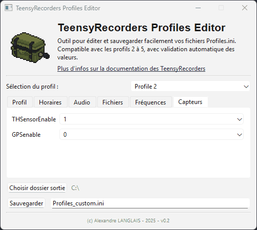

<p align="center">
  
</p>

<h1 align="center">TeensyRecorders Profiles Editor</h1>
<p align="center">
  <a href="https://www.python.org/">
    
  </a>
  <a href="https://pyinstaller.org/">
    
  </a>
  <a href="https://github.com/a-langlais/TeensyRecorders_ProfilesEditor/blob/main/LICENSE">
    
  </a>
  <a href="https://github.com/a-langlais/TeensyRecorders_ProfilesEditor/releases">
    
  </a>
</p>

Un petit utilitaire graphique en **Python + PySide6 (Qt)** pour éditer et sauvegarder facilement les fichiers `Profiles.ini` utilisés par les enregistreurs [TeensyRecorders](https://framagit.org/PiBatRecorderPojects/TeensyRecorders).<br>
Le dernier exécutable Windows (`*.exe`) est disponible [dans le dossier `dist/` du repo](https://github.com/a-langlais/TeensyRecorders_ProfilesEditor/tree/main/dist).<br>

Par défaut, les TeensyRecorders utilisent un fichier `Profiles.ini` statique composé de 5 profils, dont le premier n'est pas éditable par mesure de sécurité.<br>
Le projet est pensé pour fonctionner aussi bien en **mode script** qu’en **standalone compilé**.<br>

<p align="center">
    
</p>

---

## ✨ Fonctionnalités

- ⚙️ Édition des **profils 2 à 5** (le profil 1 reste réservé au firmware)
- 🛡️ Validation automatique :
  - `ProfileName` → ≤ 11 caractères, alphanumérique, `_` et `-` autorisés
  - `WavPrefix` → ≤ 5 caractères
  - `StartTime` / `EndTime` → format `HH:MM`
  - `MaxFileLength` → 1–999 minutes (par défaut 60)
  - `MinFreqUS` / `MaxFreqUS` → cohérence des bornes
  - `MinLevel` → 0–100 dB (par défaut 15)
  - `PreTrigger` → 0–10
  - `THSensorEnable` et `GPSenable` → 0 ou 1
- 📂 Sélection du **dossier de sortie**
- 💾 Choix du **nom du fichier de sortie** (par défaut `Profiles_custom.ini`)
- 🎨 Interface Qt moderne (PySide6)
- 🔗 Lien intégré vers la [documentation officielle TeensyRecorders](https://framagit.org/PiBatRecorderPojects/TeensyRecorders)

---

## 📂 Organisation du projet

```bash
TeensyRecorders_ProfilesEditor/
├── app/
│   ├── main.py          # Point d’entrée de l’application
│   ├── ui_editor.py     # Interface PySide6
│   ├── ini_utils.py     # Fonctions utilitaires pour les fichiers INI
│   └── config.py        # Champs, sections et configuration
│
├── compiler/            # Script de build (PyInstaller)
├── dist/                # Dernière distribution compilée
├── img/                 # Ressources graphiques (logo, captures)
├── initial_profile/     # Fichier INI de référence
│
├── .gitignore
├── requirements.txt
└── README.md
```

---

## 📦 Installation

### ⚡ Application standalone

Lancer directement l’application compilée (Windows, `*.exe`), disponible dans le dossier `dist/`.

**Dernière version** : 0.2 (2025-09)

Etape pour charger les programmes :

- Une fois votre `*.ini` généré, déplacer le fichier sur la carte SD de l'appareil. 
- Sur le menu principal, se déplacer sur `Modif. des profils` tout en bas
- Cliquer sur `Lect. fic. Profiles` et sélectionner le fichier généré
- Après retour au menu principal, sélectionner le profil voulu via la section `Profil`

---

### 🛠️ Mode développement

Cloner le projet :

```bash
git clone https://github.com/a-langlais/TeensyRecorders_ProfilesEditor.git
cd TeensyRecorders_ProfilesEditor
```

Installer les dépendances :

```bash
pip install -r requirements.txt
```

Lancer en mode développement :

```bash
python -m app.main
```

Compiler directement l’application en `*.exe` :

```bash
python compiler/compiler.py
```

---

## 📜 Licence

Projet distribué sous licence MIT.
