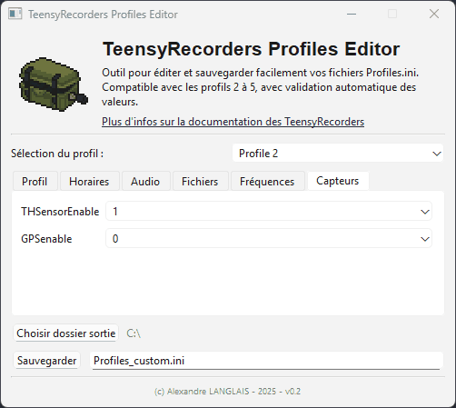

<p align="center">
  
</p>

<h1 align="center">TeensyRecorders Profiles Editor</h1>

<p align="center">
  Une application graphique simple pour préparer les profils de configuration
  des enregistreurs TeensyRecorders.
</p>

<p align="center">
  <a href="https://github.com/a-langlais/TeensyRecorders_ProfilesEditor/releases/latest">
    <strong>Télécharger la dernière version</strong>
  </a>
</p>

<p align="center">
  <a href="https://www.python.org/">
    
  </a>
  <a href="https://pyinstaller.org/">
    
  </a>
  
</p>

---

## Présentation

**TeensyRecorders Profiles Editor** permet de modifier facilement les fichiers
`Profiles.ini` utilisés par les enregistreurs
[TeensyRecorders](https://framagit.org/PiBatRecorderPojects/TeensyRecorders).

L'application évite de modifier manuellement un fichier de configuration :
les paramètres sont regroupés par thème, expliqués dans l'interface et vérifiés
avant l'enregistrement.

Les TeensyRecorders disposent de cinq profils. Par sécurité, le profil 1 reste
réservé au firmware. L'application permet de personnaliser les profils 2 à 5.

<p align="center">
  
</p>

## Installation

1. Ouvrir la page de la
   [dernière version disponible](https://github.com/a-langlais/TeensyRecorders_ProfilesEditor/releases/latest).
2. Télécharger l'archive correspondant à votre système :
   `windows`, `linux` ou `macos`.
3. Décompresser l'archive.
4. Lancer `TeensyProfilesEditor`.

> Les versions macOS et Linux peuvent demander une autorisation d'exécution
> lors du premier lancement, car l'application n'est pas signée numériquement.

## Utilisation

1. Choisir un profil parmi les profils 2 à 5.
2. Modifier les paramètres souhaités dans les différents onglets.
3. Sélectionner le dossier de destination.
4. Vérifier ou modifier le nom du fichier de sortie.
5. Enregistrer le fichier `Profiles_custom.ini`.

L'application contrôle les valeurs saisies et propose des valeurs par défaut
lorsqu'elles sont nécessaires.

## Charger le fichier sur un TeensyRecorder

1. Copier le fichier `.ini` généré sur la carte SD de l'appareil.
2. Insérer la carte SD dans le TeensyRecorder.
3. Dans le menu principal, ouvrir `Modif. des profils`.
4. Choisir `Lect. fic. Profiles`.
5. Sélectionner le fichier généré.
6. Revenir au menu principal et sélectionner le profil souhaité dans la section
   `Profil`.

## Fonctionnalités principales

- Édition des profils 2 à 5.
- Organisation claire des paramètres par thème.
- Aide intégrée pour comprendre chaque réglage.
- Validation des horaires, dates, fréquences, seuils et autres valeurs
  numériques.
- Configuration des enregistrements audio et ultrasonores.
- Réglages du mode hétérodyne.
- Gestion des options de capteurs, d'alimentation et de calcul solaire.
- Choix du dossier et du nom du fichier `.ini` généré.

## Compatibilité

La version `0.4` est compatible avec le firmware `1.03` des TeensyRecorders.

Les évolutions détaillées sont consultables dans le
[journal des modifications](CHANGELOG.md).

## Développement

Le projet est écrit en Python avec PySide6 (Qt). Pour le lancer depuis les
sources :

```bash
git clone https://github.com/a-langlais/TeensyRecorders_ProfilesEditor.git
cd TeensyRecorders_ProfilesEditor
pip install .
python app/main.py
```

Pour construire l'application localement avec PyInstaller :

```bash
pip install ".[build]"
python compiler/compiler.py
```

## Structure du projet

```text
TeensyRecorders_ProfilesEditor/
├── app/                  # Code de l'application
├── compiler/             # Scripts de construction
├── img/                  # Logo et captures d'écran
├── initial_profile/      # Profil de référence
├── CHANGELOG.md          # Historique des versions
├── pyproject.toml        # Configuration et dépendances Python
└── README.md
```

## Licence

Projet distribué sous licence MIT.
